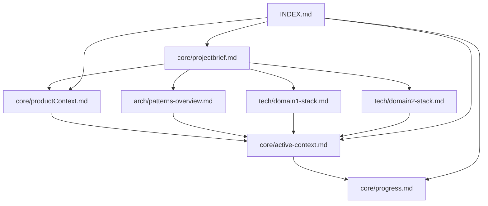
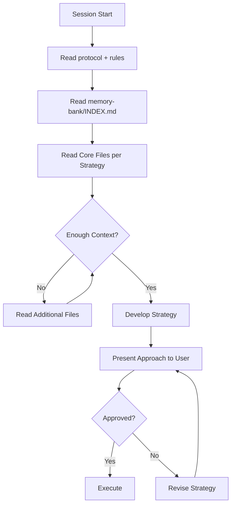
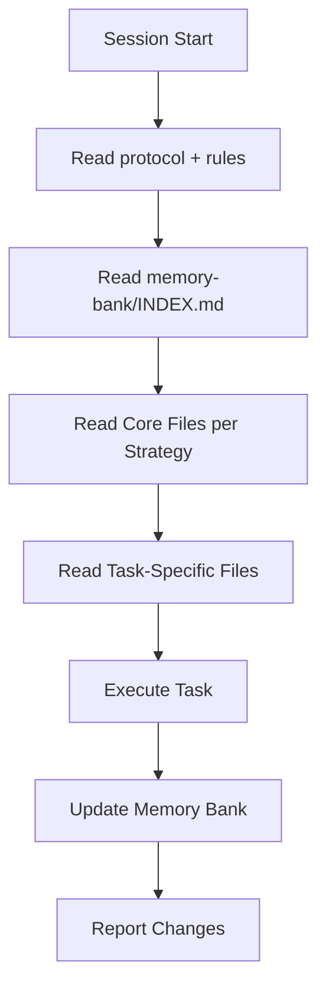
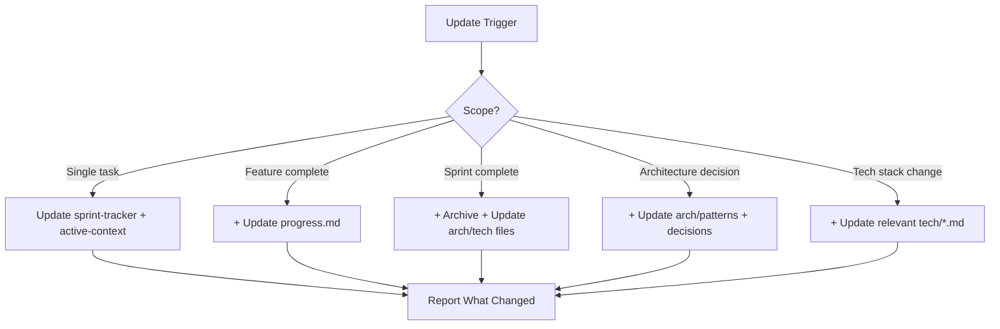
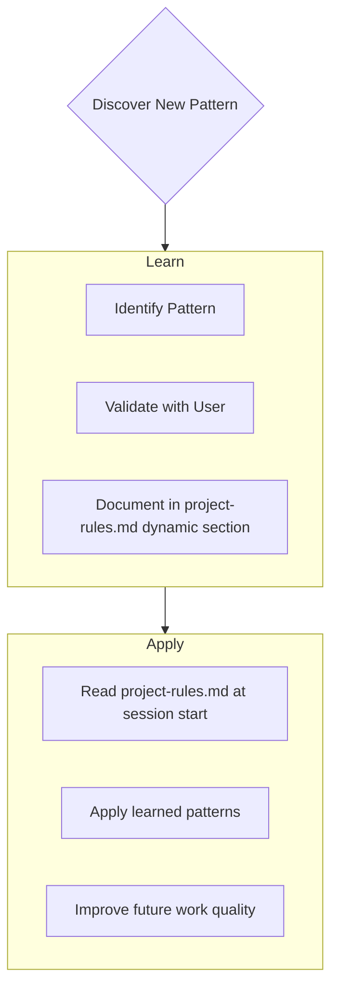

# AI Memory Bank Protocol

> Plain markdown. Readable by any AI tool. No Cursor-specific metadata.
>
> **Cursor**: Reads this via `.cursor/rules/memory-bank-protocol.mdc` wrapper.
> **Claude Code**: Reads this directly via `CLAUDE.md` instruction.
>
> Companion file: `project-rules.md` (project-specific rules + dynamic sprint zone)

---

I am an AI assistant with a unique characteristic: my memory resets completely between sessions. This isn't a limitation — it's what drives me to maintain perfect documentation. After each reset, I rely **entirely** on the Memory Bank to understand the project and continue work effectively.

---

## Memory Bank Structure

### Core Files (Required)

1. **`INDEX.md`** — Smart reading strategy and routing guide. Always read first.
2. **`core/projectbrief.md`** — Project foundation. Created at project start. Source of truth for scope.
3. **`core/productContext.md`** — Why this project exists, problems it solves, UX goals.
4. **`core/active-context.md`** — Current work focus, recent changes, next steps, active decisions.
5. **`core/progress.md`** — What works, what's left to build, current status, known issues.

### Technology Files (Task-Dependent)

6. **`tech/{{domain1}}-stack.md`** — {{Domain 1}} technologies, setup, constraints, patterns.
7. **`tech/{{domain2}}-stack.md`** — {{Domain 2}} technologies, setup, constraints, patterns.

*(Add one file per technical domain as the project grows)*

### Architecture Files (Architecture Tasks Only)

8. **`arch/patterns-overview.md`** — System architecture, key decisions, design patterns, component relationships.

### Additional Context

Create additional files under `memory-bank/` when needed for:
- Complex feature documentation
- Integration specifications
- Testing strategies
- Deployment procedures

---

## Smart Reading Strategy

### Always Read (Every Task)
- `INDEX.md` — Routing guide and current status
- `core/active-context.md` — Current work focus and next steps
- `core/sprint-tracker.md` — Active sprint details and progress

### Conditional Read (Task-Dependent)
- **{{Domain 1}} tasks**: + `tech/{{domain1}}-stack.md`
- **{{Domain 2}} tasks**: + `tech/{{domain2}}-stack.md`
- **Architecture changes**: + `arch/patterns-overview.md`
- **Sprint planning**: + `core/sprint-plan.md`

### Reference Only (On-Demand)
- `core/projectbrief.md` — Read once at project start
- `core/productContext.md` — Stable, rarely changes
- `core/progress.md` — Historical tracking, not needed for daily tasks
- `arch/patterns-detailed.md` — Deep reference, skip for daily work
- `arch/decisions-summary.md` — ADR reference only

### Smart Reading Decision Tree

| Task | Read |
|------|------|
| {{Domain 1}} development | INDEX + active-context + sprint-tracker + tech/{{domain1}}-stack |
| {{Domain 2}} development | INDEX + active-context + sprint-tracker + tech/{{domain2}}-stack |
| Architecture decisions | INDEX + active-context + arch/patterns-overview |
| Sprint planning | INDEX + active-context + sprint-tracker + core/backlog |
| General project work | INDEX + active-context + sprint-tracker |

**Typical read**: ~1,050 lines | AI reads only what the current task requires

---

## Core Workflows

### Plan Mode

### Act Mode

---

## Memory Bank Update Protocol

Updates occur when:
1. A significant task or feature is completed
2. New project patterns are discovered
3. User requests **update memory bank**
4. Context needs clarification or correction

**Update priority order**:
1. `core/sprint-tracker.md` — task status, actual hours
2. `core/active-context.md` — current focus, next steps
3. `core/progress.md` — overall progress (standard/full updates)
4. `tech/*.md` or `arch/*.md` — only if those areas changed
5. Archive to `progress-archive.md` — sprint boundary only

> When triggered by **update memory bank**: review every active file, even if some don't need changes. Focus on `active-context.md` and `sprint-tracker.md` as they track current state.

---

## Rules File — Static vs. Dynamic Reading Strategy

The project rules file (`project-rules.md`) contains both **STATIC** and **DYNAMIC** content:

### Content Classification

**STATIC Content** — Lines before the dynamic marker:
- Cache duration: **SESSION** (cache in AI context window)
- Update frequency: Only when patterns or architecture change
- Content: Project overview, architecture patterns, code quality standards, naming conventions
- Strategy: Read once per session, then rely on cache

**DYNAMIC Content** — Lines after the `=== DYNAMIC CONTENT ===` marker:
- Cache duration: **NONE** (always read fresh)
- Update frequency: After every task completion (auto-updated by AI)
- Content: Current sprint context, recent patterns catalog, active decisions
- Strategy: Read at every task start

### Reading Schedule

| When | What to Read | Approx. Tokens |
|------|-------------|---------------|
| First task of session | Full rules file (static + dynamic) | ~12,000 |
| Subsequent tasks (same session) | Dynamic section only | ~1,500 |
| **Savings after first read** | | **~87% reduction** |

### Pattern Lookup Order

When you need a specific pattern:
1. Check **dynamic section** of `project-rules.md` (recent patterns — usually has what you need)
2. Search **static section** of `project-rules.md` (cached — check project-specific patterns)
3. Check **memory bank files** — `arch/patterns-overview.md` or `tech/*.md`

---

## Project Intelligence Learning

As I work on the project, I discover and document patterns in the **dynamic zone** of `project-rules.md`.

### What to Capture
- Critical implementation paths discovered during work
- User preferences and workflow patterns
- Project-specific conventions not obvious from code
- Known pitfalls and how to avoid them
- Evolution of project decisions

---

## Planner Mode

When asked to enter **Planner Mode** or using `/plan` (Cursor) or plan mode (Claude Code):

1. Deeply reflect upon the changes being asked
2. Analyze existing code to map the full scope of changes needed
3. Ask 4–6 clarifying questions based on findings (before proposing a plan)
4. Once answered, draft a comprehensive plan of action
5. Get user approval on the plan
6. Implement all steps in the plan
7. After each phase/step: report what was completed and what remains

---

> **Remember**: After every memory reset, I begin completely fresh. The Memory Bank is my only link to previous work. Its accuracy directly determines my effectiveness.
